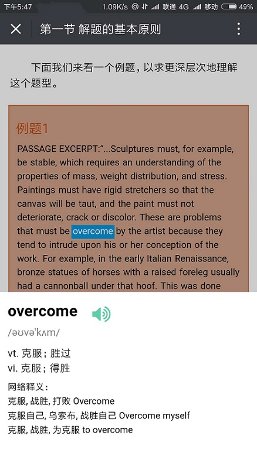

>单词翻译常见于APP中，那么在网页中对于一段中英混杂的内容怎么准确的做到单词的翻译呢？

我要渲染的内容是一段段的html，用react渲染一段html内容是没有什么难度，使用dangerouslySetInnerHTML 即可。但是可以做到将内容中的英文单词翻译出来，是怎么实现的呢？一起来看一下吧。
## 效果





## 事情是这样的...
我前端是做内容展示，后台将Html格式的内容传递到前端，前端原生元素的dangerouslySetInnerHTML 属性去解析html内容，就可以使用react框架渲染html了


仔细看，这个属性用的是{{  }}2个括号而不是1个括号。原因是：第一{}代表jsx语法开始，第二个是代表dangerouslySetInnerHTML接收的是一个对象键值对。它接收的内容是html的，很容易收到XSS攻击，所以这个属性有了dangerous这个单词...

## 过程

- 重组英文单词
后台传给我的一段一段的内容是这样的：


既然要提取出来做单词翻译，就得有能力去获取每一个单词，所以我的打算是，把内容提取出来，是一个英文单词就放进一个span标签中。但是这一步在哪里处理比较好呢，**我想了想，在页面渲染之前处理吧， 这样页面渲染的压力要减小，提高渲染速度**。所以我在前端接收到后端发送的数据之后，在存入store之前就先处理好。

```
        case "OBT_BOOK_CONTENT_SUCCESS":
            var newContents = action.meta.bookcontent.map((item, index) => {
                item.paragraphContent = item.paragraphContent.replace(/src="/g, `src="${url}`);
                //处理caseContent中的单词
                var div = document.createElement('div');
                div.innerHTML = item.paragraphContent;
                var caseContent = div.querySelector('.caseContent');

                if (caseContent) {
                    var arr = caseContent.innerText.split(" ");
                    for (var i = 0; i < arr.length; i++) {
                        arr[i] = "<span>" + arr[i] + "</span>"
                    }
                    caseContent.innerHTML = arr.join("");
                    item.paragraphContent = div.innerHTML;
                }
                return item;
            })
            return Object.assign({}, state, {
                bookcontent: newContents
            })
```

由于传给我的是一大段内容，里面的元素的类型不只一种、类名也不止一种，有div .caseTitle .caseContent strong等等，但是我只处理面积最大的一块英文，也就是只处理caseContent中的英文单词这就好办了。我没有用string的方法，去查找这个串在什么位置，怎么截取怎么拼接。没有。**我利用了DOM的原理，借助DOM原生的api帮助我得到我要的英文单词。我创建了一个div(没有DOM我就自己创建DOM咯)，然后DOM查找.caseContent**，用空格把其中的所有单词提取出来，再给每一个单词用span包起来，然后把.caseContent中的内容替换掉,同时div的innerHTML也就变了，最后改变paragraphContent。就这样把后端传过来的东西做了修改，再使用。

 - 提取单词
   由于我想要翻译的单词是用span包裹的，所以我需要检查用户点击屏幕所在的节点是不是span

```
if(e.target.nodeName === 'SPAN'){
        var s = "";
       if(e.target.innerText) {
            var len = e.target.innerText.length;
            if( !/^[\u4e00-\u9fa5]{0,}$/.test(e.target.innerText) ){
                if(e.target.innerText[len -1 ] === ',' || e.target.innerText[len -1 ] === '.' ){
                    s = e.target.innerText.substring(0, len -1 )
                }else {
                    s = e.target.innerText;
                }
                var chooseSpan =   e.target;
               
                this.props.checkWords(s, chooseSpan);
            }
       }
       console.log( s);
    }
```

利用正则`!/^[\u4e00-\u9fa5]{0,}$/`提取出来英文单词，但是有些单词末尾会带着英文状态下的逗号,句号.，所以还需要用`substring`剪切一下单词，再调用方法。

这里，提取页面中点击的内容，需要CSS的配合。

```
user-select: text;
```
user-selct: text;可以让页面中的内容被选中。而 user-select: none是让页面中的内容不被选中。

```-moz-user-select: none;
  -ms-user-select: none;
  -webkit-user-select: none;
  user-select: none;
```
获取了单词s之后，还需要做一点交互，就是被选中的单词高亮起来，所有，span元素也需要被处理，为了严谨，所以需要再判断是不是单词，是的话，再对span 做处理。

```
 checkWords(txt, selectedSpan) {
    // 查单词
   
    this.selectedSpan = selectedSpan;
    if (txt.toString().length > 1) {
      if (/^\w+$/.test(txt)) {
        this.props.getWord(txt);
        this.setState({
          showWord: true
        })
        selectedSpan.style.color="#fff";
        selectedSpan.style.backgroundColor="rgb(0,153,223)";
      }
    }
  }
```
 - 请求翻译接口
**getWord**方法中调用了查单词的api,我用的是有道智云的api，需要自己注册一个账号，然后申请一个应用。获取appKey和appSecret,设置好from 和 to 的值，也就是你要从什么语言转什么语言，准备一个随机数salt， 然后各种生成签名一波操作。

```
var appSecret = 'GOPjZoiSnH592P31Qn6xoallHn3zUnSh';
  var appKey = '06fc15a9c06cb290';
  var salt = '' + (new Date).getTime();
  // 多个query可以用\n连接  如 query='apple\norange\nbanana\npear'
  var from = 'en';
  var to = 'zh-CHS';
  var str1 = appKey + q + salt + appSecret;
  var data = null;
  var sign = md5(str1);
  var sendRes = res;
  sign = sign.toUpperCase();
  q = encodeURI(q);
  var url = `http://openapi.youdao.com/api?q=${q}&from=${from}&to=${to}&appKey=${appKey}&salt=${salt}&sign=${sign}`
```

有了这个url之后，就可以请求了。返回的东西是：


播放单词的地方就是用 H5的audio 元素,src是 
`http://dict.youdao.com/dictvoice?audio=${this.props.word.query}`

```
<audio   id="audio" >
      <source src={voiceUrl} type="audio/mp3"></source>
 </audio>
 ```
后来发现扇贝的单词api做的也不错，没有有道用的这么麻烦，有道还需要签名，用户量大的时候也会有限制，准备以后换扇贝的。
## 完毕
至此，使用react框架完成移动页面的定向单词翻译已完成。其中配合了CSS,DOM，正则，使用别家api等知识，算是一次小小的综合考核吧，不知道有没有其他同学也做过这样的事情，如果有的话，可以交流一下啊。

