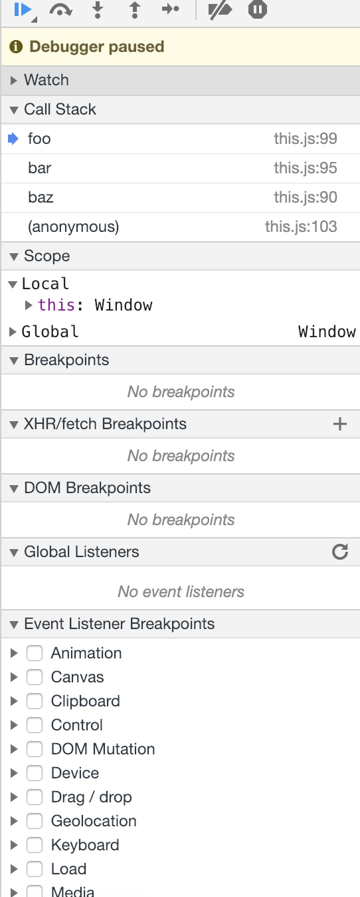

# js基础-1 调用堆栈

调用栈是解释器（就像浏览器中的javascript解释器）追踪函数执行流的一种机制。当执行环境中调用了多个函数时，通过这种机制，我们能够追踪到哪个函数正在执行，执行的函数体中又调用了哪个函数。

- 每调用一个函数，解释器就会把该函数添加进调用栈并开始执行。
- 正在调用栈中执行的函数还调用了其它函数，那么新函数也将会被添加进调用栈，一旦这个函数被调用，便会立即执行。
- 当前函数执行完毕后，解释器将其清出调用栈，继续执行当前执行环境下的剩余的代码。
- 当分配的调用栈空间被占满时，会引发“堆栈溢出”。

```js
function greeting() {
   // [1] Some codes here
   sayHi();
   // [2] Some codes here
}
function sayHi() {
   return "Hi!";
}

// 调用 `greeting` 函数
greeting();

// [3] Some codes here
```

上面的代码将这样执行:

1. 忽略前面所有函数，直到greeting()函数被调用。
2. 把greeting()添加进调用栈列表。
3. 执行greeting()函数体中的所有代码。

> 调用栈列表:
>  
> -greeting

4. 代码执行到sayHi()时，该函数被调用。
5. 把sayHi()添加进调用栈列表。
6. 执行sayHi()函数体中的代码，直到全部执行完毕。
>调用栈列表:
>
> -greeting
>
> -sayHi

7. 返回来继续执行greeting()函数体中sayHi()后面的代码。
8. 删除调用栈列表中的sayHi()函数。
9. 当greeting()函数体中的代码全部执行完毕，返回到调用greeting()的代码行，继续执行剩余JS代码。

> 调用栈列表:
>
> -greeting

10. 删除调用栈列表中的greeting()函数。

一开始，我们得到一个空空如也的调用栈。随后，每当有函数被调用都会自动地添加进调用栈，执行完函数体中的代码后，调用栈又会自动地移除这个函数。最后，我们又得到了一个空空如也的调用栈。

再来看个例子：

```js
function baz() {
    console.log('baz');
    bar();
}

function bar() {
    console.log('bar');
    foo();
}

function foo() {
    debugger;
    console.log('foo');
}

baz();
```

浏览器中的调用堆栈截图：

